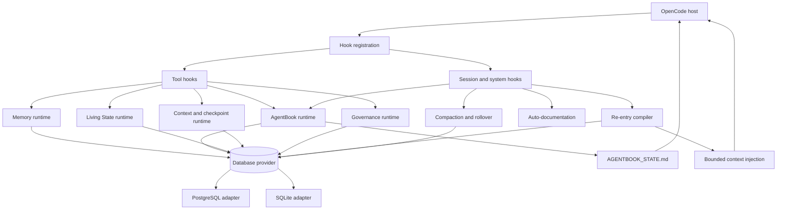
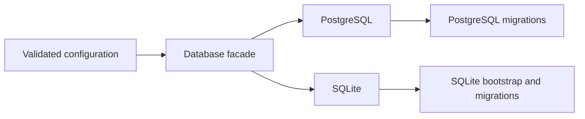
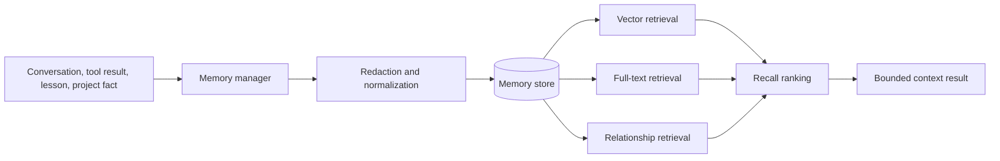
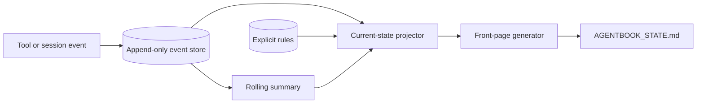
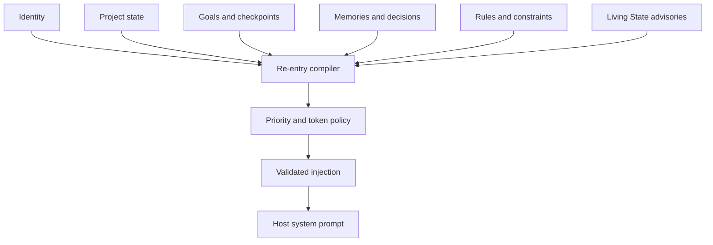
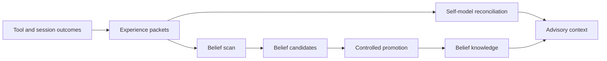
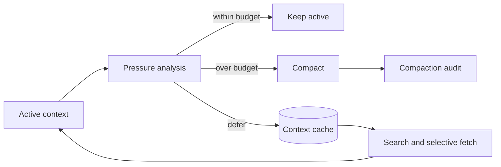

# Product Architecture

This document describes the stable product architecture of Cross-Session Memory. It is intentionally separate from `docs/ARCHITECTURE.md`, which is an auto-generated repository graph and may contain workspace-specific snapshots.

## Design goal

CSM exists to make continuity a first-class runtime capability.

The system must preserve useful history without flooding the active prompt, reconstruct current work without inventing state, and expose enough provenance for an agent or operator to understand why a piece of context was selected.

## Architectural principles

1. **Continuity is layered.** Long-term memory, current project state, internal observations, work state, and active context are different concerns.
2. **History and projection are separate.** Append-only evidence should not be confused with a mutable current-state view.
3. **Retrieval must be bounded.** More stored information must not automatically mean more injected information.
4. **Provider differences must be explicit.** Unsupported database features are removed from the tool surface.
5. **Promotion requires evidence.** Derived beliefs and governance decisions remain revisable and provenance-aware.
6. **Failure should preserve recoverability.** Checkpoints, event history, source attribution, and non-destructive merge behavior support rollback and audit.
7. **The fresh-session path matters most.** Continuity must be available before an agent begins ordinary work.

## Runtime overview

## Runtime layers

### 1. Host integration

`src/hooks-registration.ts` is the composition root for the OpenCode plugin. It initializes the configured provider, constructs runtime services, registers lifecycle hooks, and exposes tools.

`src/hooks/tool-hooks.ts` builds the runtime tool surface. Provider and runtime guards are applied after tool construction so unsupported tools do not remain visible.

Key responsibilities:

- create shared runtime dependencies
- register tool definitions
- attach session and system hooks
- enforce provider-aware availability
- apply re-entry source-only guards
- dispose resources cleanly

### 2. Storage

The storage layer is selected through configuration.

#### PostgreSQL

PostgreSQL is the complete feature path. It supports the full memory, governance, Living State, context-cache, checkpoint, goal, and reporting stack.

#### SQLite

SQLite is a local core path. It provides implemented core capabilities and removes PostgreSQL-only tools during registration.

The system does not present provider parity where parity does not exist.

### 3. Durable memory

The memory layer owns durable records and recall.

Primary responsibilities:

- save and classify memory
- search across vector and text surfaces
- filter by type, tags, entities, and importance
- traverse relationships
- store lessons and transcript-derived records
- distill content
- compact context
- backfill embeddings
- detect duplicates
- merge or supersede records
- generate maintenance and archive candidates

### 4. AgentBook

AgentBook owns operational project continuity.

It deliberately separates immutable history from mutable projection.

Components include:

- event store
- event classification
- rules store
- summary generator
- state projector
- front-page renderer
- event, state, and rule tools

AgentBook answers the immediate operational question: what is being worked on, what changed, what is blocked, and what should happen next?

### 5. Re-entry

The re-entry system compiles a fresh-session context block from durable sources.

Potential layers include:

- identity and self-continuity
- project and phase state
- goals and checkpoints
- constraints and rules
- relevant memories
- decisions and errors
- promoted knowledge
- advisories
- handoff state
- readiness and provenance

The compiler does not inject every available record. It selects and trims according to priority and budget.

### 6. Living State

Living State converts structured experience into revisable internal knowledge.

Important boundaries:

- experience packets are observations, not conclusions
- capability confidence is revisable
- belief candidates are not automatically durable knowledge
- promotion is gated
- advisory output can be previewed and debugged

### 7. Context control

The context-control layer manages active prompt pressure and deferred retrieval.

It includes:

- token-bucket analysis
- compaction
- compaction quality and audit
- context rollover
- context cache
- context manifest
- selective context search and fetch
- file-region retrieval
- last-error and decision-log retrieval
- checkpoint injection
- goal-aware transforms
- context-fault recovery

### 8. Work continuity

Work continuity preserves execution state that should survive beyond one conversation.

It includes:

- active goals
- goal updates and history
- checkpoints
- checkpoint references
- decision and error evidence
- work-ledger survival
- handoff state
- causal links across sessions

This layer is narrower than long-term memory. It is optimized for resuming unfinished work safely.

### 9. Governance

Governance evaluates the quality and usability of stored continuity.

Key surfaces:

- recall-quality reporting
- continuity resilience reporting
- provenance completeness
- evidence strength
- duplicate detection
- archive candidates
- safe merge and supersede
- migration verification
- backup/restore drills

Governance is advisory unless a specific enforcement contract states otherwise.

## Write paths

### Memory write path

1. A hook or tool receives source material.
2. Content is normalized and redacted according to configuration.
3. Memory metadata and provenance are constructed.
4. The provider writes the durable record.
5. Embeddings and relationships are added when supported.
6. Telemetry and follow-up maintenance surfaces observe the result.

### AgentBook write path

1. Tool or session activity is classified.
2. File, command, result, and failure evidence are extracted.
3. An append-only event is stored.
4. Threshold summary generation is evaluated.
5. Current state is projected.
6. The front page is written to the active project directory.

### Living State write path

1. A structured outcome becomes an experience packet.
2. Capability and belief scanners evaluate the packet.
3. Candidates remain separate from durable promoted knowledge.
4. Promotion occurs only through the configured policy.
5. Advisory output is generated from current evidence.

## Read paths

### Recall path

1. A query is normalized.
2. Eligible retrieval surfaces execute.
3. Results are combined and ranked.
4. Filters and quality signals are applied.
5. The result is bounded for the caller.

### Fresh-session path

1. OpenCode reads repository instructions, including `AGENTBOOK_STATE.md`.
2. CSM constructs the configured re-entry layers.
3. Sources are prioritized and trimmed.
4. The injection contract is validated.
5. The host receives a bounded continuity block.
6. Source attribution remains available for diagnosis.

### Deferred-context path

1. Context is stored or indexed in the cache.
2. The manifest records available deferred material.
3. Search tools identify relevant entries.
4. Fetch tools retrieve bounded regions or evidence.
5. Only selected material re-enters the active prompt.

## Failure and recovery behavior

The architecture favors explicit degradation over hidden partial behavior.

- SQLite-only limitations remove tools at registration.
- Re-entry can run in preview mode.
- Source-only recovery can block ordinary tools while re-entry is unresolved.
- Front-page writes are best-effort where the markdown result can still be returned.
- Checkpoints and event history preserve recovery evidence.
- Merge and archive workflows avoid immediate destructive loss.
- CI retains schema and test diagnostics when a database matrix leg fails.

## Repository boundaries

| Path | Ownership |
|---|---|
| `src/hooks-registration.ts` | Runtime composition |
| `src/hooks/` | Host lifecycle integration |
| `src/tools.ts` | Core memory and continuity tools |
| `src/hooks/tool-hooks.ts` | Tool registration and provider guards |
| `src/agentbook-*.ts` | AgentBook |
| `src/reentry-*.ts`, `src/re-entry-protocol.ts` | Re-entry |
| `src/context-cache-*.ts` | Deferred context |
| `src/checkpoint-*.ts`, `src/goal-*.ts` | Work continuity |
| `src/living-state-*.ts`, `src/belief-*.ts`, `src/self-model-*.ts` | Living State |
| `src/database.ts`, `src/db/`, `src/schema/` | Storage and migrations |
| `test/` | Regression and contract verification |
| `scripts/` | Operational and verification commands |
| `docs/` | Product docs, contracts, reports, and history |

## Extension rules

A new subsystem should:

1. declare its durable data ownership
2. define provider support explicitly
3. register tools through the composition root
4. include provenance and failure behavior
5. respect context budgets
6. add migrations and compatibility tests when storage changes
7. add focused and full-suite verification
8. update the feature map and product architecture
